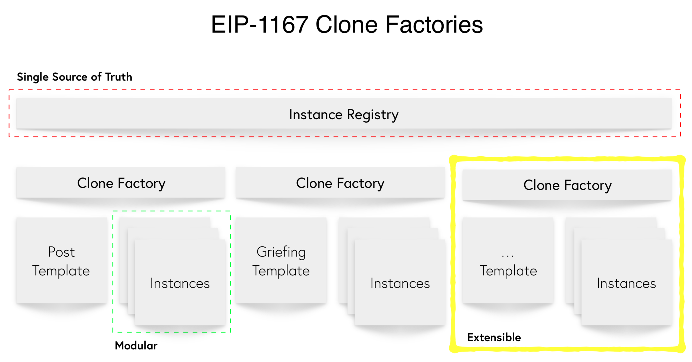

# Erasure Protocol

[](https://travis-ci.com/erasureprotocol/erasure-protocol)
[](https://github.com/erasureprotocol/erasure-protocol/actions)


## Philosophy of Erasure

The Erasure Protocol builds on the three primitives of an economic relationship: Track-Record, Payment, and Recourse.

1. [Track-record through Posts and Feeds](#track-record-through-posts-and-feeds)
2. [Payments through any cryptocurrency](#payments-through-any-cryptocurrency)
3. [Recourse through Griefing](#recourse-through-griefing)

## Track-record through Posts and Feeds

`Erasure_Posts` keep track of the hash and timestamp of all the data submitted to the protocol. This serves as a proof of existence on which a track-record can be built. Creating a `Post` instance is as simple as submitting a [multihash](https://github.com/multiformats/multihash) of your data to the smart contract. At first the data is hidden, but it can be publicly revealed at a later point by uploading it to decentralized storage. A Post will be particularly useful for one-off predictions or submissions.

Extending the concept of a Post is a `Feed`. A Feed allows for a user to establish credibility through an ordered history of Post committed. Since these posts are in a single append-only array, it is not possible to erase or reorder them once submitted. A Feed is designed for use-cases with continuous predictions.

The hash which is submitted to the Post contract is called a `proofHash`. A proofHash should be generated by prepending the submitted data with a user address and a user generated salt to avoid potential impersonation or snooping attacks.

```
proofHash = multihash(userAddress + salt + data)
```

## Payments through any cryptocurrency

The Erasure Protocol is designed to support any Ethereum-native cryptocurrencies such as ETH, WBTC and NMR within its programmable escrow smart contracts. The first escrow template called `CountdownGriefingEscrow` supports payments in NMR. All Erasure escrows are registered in the `Erasure_Escrows` registry which contributes to the single source of truth.

## Recourse through Griefing

Recourse is achieved when a party is punished for wrongdoing. In the world of Erasure, this translates directly to staking and burning. When two parties decide to engage, they begin by staking NMR and agreeing on a set of conditions for punishment. We call this combination of skin in the game and rules of engagement an `Erasure_Agreements`.

The first type of agreement used on Erasure is called `Griefing`. Griefing allows a party to come to a resolution without a third party arbitrator through punishing their counterparty at a cost. This follows research in neuroeconomics which observes that cooperation evolves in populations where altruistic punishment such as griefing is possible.

Creating a Griefing agreement is as simple as having two parties agree on their respective “ratio” and amount to stake. Your ratio represents some amount of NMR that your counterparty can spend (“cost”) to burn 1 NMR of yours (“punishment”). When griefing occurs, both the cost and the punishment are burned from the NMR supply forever.

Take for example an agreement between Alice and Bob. Alice is anonymous and has not built a track record. She stakes 500 NMR and selects a ratio of 0.5. Bob, however, has revealed his real-world identity and has an excellent track record. As such, he stakes 100 NMR and selects a ratio of 1.0.

*Please note: punishments are paid from pre-committed NMR stake but costs are paid from liquid NMR tokens.*

| Action                                     | Resulting Alice stake | Resulting Bob stake |
| ------------------------------------------ | --------------------- | ------------------- |
| Alice stakes 500 NMR with ratio 0.5        | 500                   | 0                   |
| Bob stakes 100 NMR with ratio 1.0          | 500                   | 100                 |
| Bob pays 5 NMR to punish Alice for 10 NMR  | 490                   | 100                 |
| Alice pays 10 NMR to punish Bob for 10 NMR | 490                   | 85                  |

Griefing avoids relying on a centralized oracle or a trusted third party to perform arbitration over the terms of the agreement and instead allows the parties to come to a resolution on their own. As new techniques for resolution like decentralized oracles are built on Ethereum, it will be possible to add them to the set of `Erasure_Agreements`.

---

## The Architecture

Every agreement, user, entry, whatever may have its own account, and those accounts (or the factories that deploy them) can report back to simple, shared registries that establish a single source of truth for a given protocol. This grants individual agents in the system the authority to opt-in to new changes, gives rise to a diversity of options for how to interact with the system, and makes the system more decentralized.

So far, the registries developed are:

- `Erasure_Agreements`
- `Erasure_Posts`
- `Erasure_Users`
- `Erasure_Escrows`

Using the Spawner library, every item on Erasure is created as a clone of a previously deployed template. We call these **Clone Factories**. Every clone is also registered in a registry which provides a single source of truth on the status of the protocol.



---

## Deployed contracts

See [latest release](https://github.com/erasureprotocol/erasure-next-contracts/releases).

## Packages
- [Erasure Crypto + IPFS Helpers](https://github.com/erasureprotocol/erasure-protocol/tree/master/packages/crypto-ipfs)
